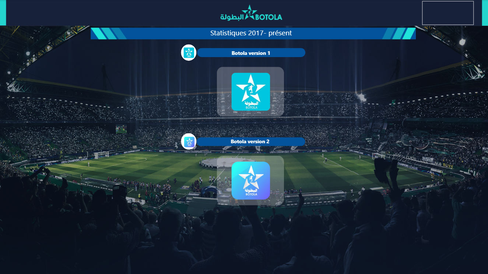
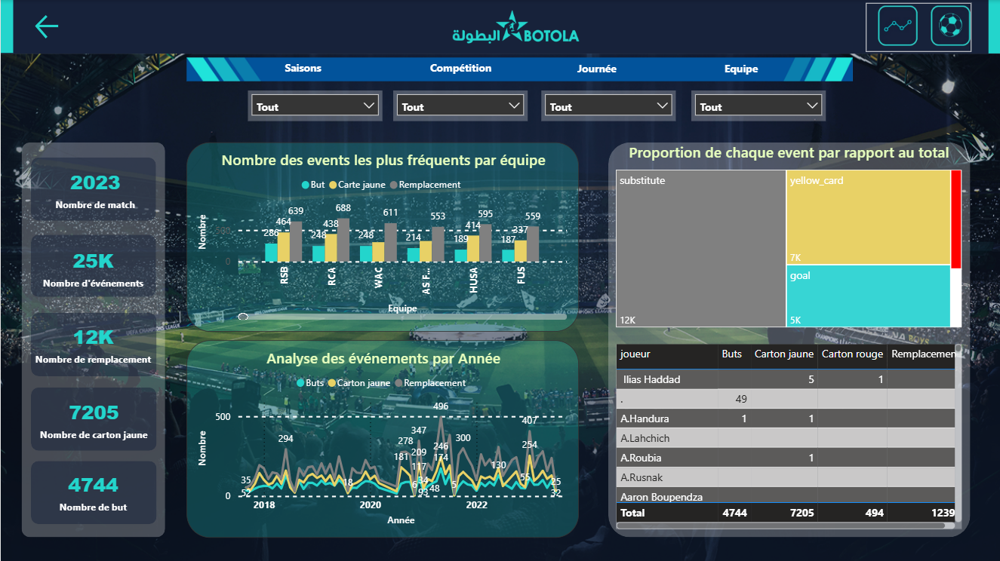
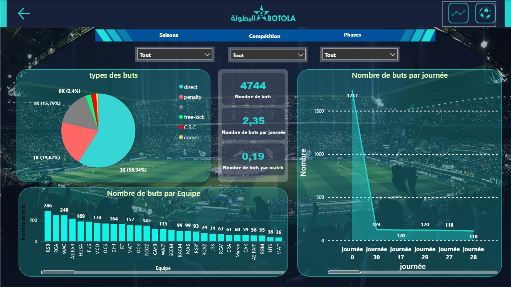
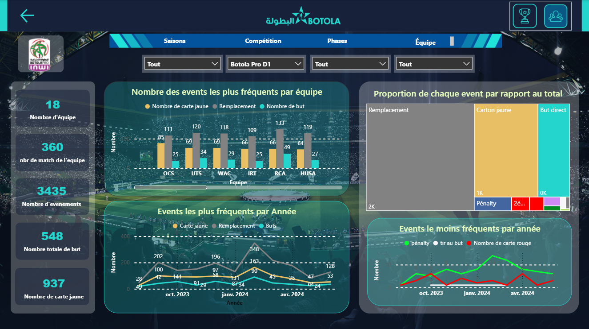
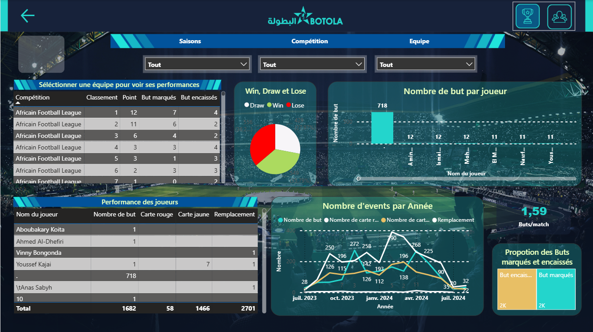

# ⚽ Power BI Project – Football Analytics for SNRT & Professional Teams

## 📌 Project Description

This Power BI project was developed as part of my work with SNRT (Moroccan Public broadcasting company) . It reflects my journey of **exploring data integration, cleaning, modeling, and visualization using Power BI and DAX**. This initiative marked a **first-of-its-kind effort within SNRT**, driving the adoption of data-driven decision-making among media professionals and football clubs.

Due to **confidentiality agreements and sensitive data sourced from internal corporate databases**, I am **unable to share the Power BI file itself**. However, I’m showcasing key **dashboard screenshots** and providing a **complete breakdown** of its structure and logic to highlight my contributions and technical skills.

---

## 🧠 Key Contributions

- 🔗 Integrated multiple corporate databases, including two versions of the application with distinct structures.
- 🧹 Cleaned and transformed raw football event data using Power Query.
- 📊 Utilized **DAX** for advanced KPIs, performance scoring, and dynamic visual calculations.
- 🎯 Designed interactive and detailed visual reports to analyze:
  - Team and player performance
  - Match statistics
  - Goal breakdowns
  - Event tracking (cards, substitutions, fouls, etc.)
- 📺 Delivered valuable insights to **support television channels and sports analysts** in strategic planning and live broadcast preparation.

---

## 🌍 Project Structure (2 Versions – Unified Dashboard Entry)

When you open the dashboard, you're presented with **two clickable icons** on the homepage – each representing a different **version of the application** due to a major data system upgrade.

### 🏠 Main Page: Dashboard Navigation

> 

This page contains **two icons**:
- 📁 **First Version (Legacy Application)**
- 🆕 **Second Version (Updated Application)**

---

## 🗂️ Version 1: Legacy Application (2 Pages)

### 📄 1. Analysis of Events & Matches

> 📸 

### 📄 2. Analysis of scores

> 📸  

---

## 🆕 Version 2: Updated Application (3 Pages)

### 📄 3. Analysis per competition

> 📸   

### 📄 4. Analysis per team

> 📸     

---

## 🏁 Total Pages: 5

| Page Title                    | Description                                |
|------------------------------|--------------------------------------------|
| Main Page                    | Navigate between dashboard versions        |
| Analysis of Events & Matche      | Match and event breakdown (Version 1)      |
| Analysis of scores            | Goal statistics and visual breakdown       |
| Analysis per competition   | Competition-based analysis (Version 2)     |
| Analysis per team           | Team-level insights and comparisons        |

---

## 🏆 Impact

> 🔥 **First Power BI dashboard ever implemented at SNRT.**

- Sparked **data culture adoption** across departments.
- Served as an **internal reference project** for future initiatives.
- Used directly by TV channels and football clubs for performance reviews and tactical insights.

---

## ❗ Confidentiality Notice

Due to the sensitive nature of the data and my responsibility to safeguard corporate assets, the `.pbix` file will **not be published**. This README and the included screenshots are intended to give recruiters and collaborators a clear understanding of my capabilities in business intelligence and storytelling through data.

---

## 📷 Screenshots Folder

Please refer to the `Screenshots/` folder in this repo to explore each page's design and logic visually.

---

## 🧑‍💼 Author

**Mohamed Amine EL RHERBI** – Data Enthusiast 
